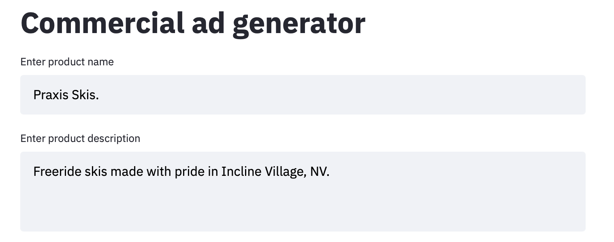

# CS329S-project
**What this is:**

A demonstration of commercial ad creation (FB, Instagram, Google ad campaigns etc). This work uses two custom datasets (commercial ads scraped from moat.com and non-commercial images by Unsplash). The pipeline takes company name and informal product description as input, and generates suitable ad taglines with GPT-3. From there, the tagline is used to semantically search moat.com database with CLIP for examples of similar commercial images. These images (alongside with tagline) are then used to semantically search Unsplash image databaset to produce the final ad version.

**Credits**: [Unsplash](unsplash.com) produces the royalty-free images for this project. Vladimir Haltakov [extracted the CLIP features](https://github.com/haltakov/natural-language-image-search) for Unsplash. GPT-3 and CLIP models are provided by [OPENAI](openai.com)

**Requirements**: 
1. moat images dataset unzipped into directory ./moat-images/moat_full_imgs/
https://moat-dataset.s3-us-west-2.amazonaws.com/moat_full_imgs.zip

3. supplementary REST microservices running with IP addresses known to streamlit app:


https://github.com/volkfox/moat-search

https://github.com/volkfox/unsplash-search

https://github.com/volkfox/GPT3-gen

**Run:**
```
streamlit run app.py
````

**How to use the app:**

```
1. Point your browser to Streamlit URL, e.g.: 
http://54.201.80.61:8000
```
```
2. Enter the company name and the freeform product description:
```

```
3. Submit by pressing ⌘-ENTER and watch GPT-3 tagline extensions populated.
You can also edit the tagline at this point.
```


```
4. See the commercial ads that are semantically close to this tagline (source: moat.com)
```


```
5. See the non-commercial (royalty-free) images from Unsplash semantically close to this tagline.
```


```
6. Optionally, choose to reverse-search Unsplash with Moat ads by adding the ad index
```


```
7. Adjust tagline overlay to match the style and layout of ad
```

